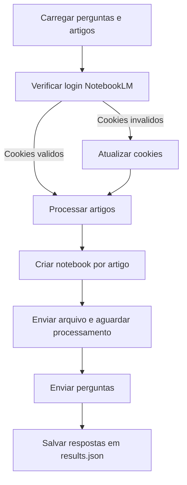

# NotebookLM Systematic Review Helper

## Objetivo

Automatizar a etapa de extração de dados em revisão sistemática usando uma API customizada do NotebookLM. O fluxo cria um notebook por artigo, envia perguntas e salva as respostas em um JSON.

## Requisitos

- Python instalado
- Google Chrome
- chromedriver na raiz do projeto (ou `CHROMEDRIVER_PATH` definido). Baixe a versao compativel com seu Chrome: https://developer.chrome.com/docs/chromedriver/downloads/version-selection?hl=pt-br

O Chrome e o chromedriver sao usados exclusivamente para gerenciar a sessao da conta Google (captura/refresh de cookies). Se voce tiver outra forma de obter e manter os cookies, pode usar apenas a API preenchendo `COOKIES` no `.env`.

Exemplo para verificar a versao do Chrome no Windows:

```powershell
"$env:ProgramFiles\Google\Chrome\Application\chrome.exe" --version
```

Exemplo para verificar a versao do Chrome no Ubuntu:

```bash
google-chrome --version
```

## .env

Arquivo obrigatório na raiz do projeto. Use o modelo em .[env.example](,env.example).

Variáveis:

- `USER_EMAIL`: email da conta Google usada no NotebookLM. Necessário para validar o login.
- `COOKIES`: string de cookies. Esse valor é atualizado automaticamente pelo fluxo de refresh (você não precisa preencher manualmente)

## Estrutura de pastas

Obs: Só se preocupe com o que você precisa preencher, o resto é gerenciado pelo sistema.

- data/questions.json: lista de perguntas (array de strings). ***PRECISA PREENCHER. O sistema não guarda histórico da conversa, então cada pergunta é como se houvesse apenas essa pergunta no chat. Caso você precise de histórico, sinta-se livre para contribuir com o projeto 🙂***
- data/results.json: respostas consolidadas.
- data/memory/sessions_ids.json: estado por artigo (notebook, upload, processamento).
- data/memory/chrome_profile.json: estado do perfil gerenciado (login, flags).
- data/memory/chrome_profile_managed/: perfil persistente usado no login.
- papers/: artigos (.pdf) que serão processados. ***PRECISA PREENCHER***

## Arquivos de exemplo

Este repositório inclui alguns papers em papers/ e arquivos em data/ apenas para demonstrar o uso. Substitua pelos seus próprios arquivos antes de rodar em produção.

## Fluxo geral



## Perfil do Chrome (copia gerenciada)

Para evitar bloqueios do Chrome e garantir login persistente, o fluxo usa um perfil gerenciado em data/memory/chrome_profile_managed. Na primeira execucao, o Chrome abre para o usuario autenticar a conta Google. Depois disso, as proximas execucoes podem rodar em modo headless e reaproveitar a sessao. Se o login nao estiver valido, o navegador abre novamente para reautenticacao. A captura de cookies e feita via Selenium.

## Execucao

```bash
python app.py --threads 3
```

Cada thread processa um artigo em paralelo. Ainda não foi testado quantas threads a API aguenta antes de bloquear. **Se tratando da sua conta google, você é responsável pelos danos.**
